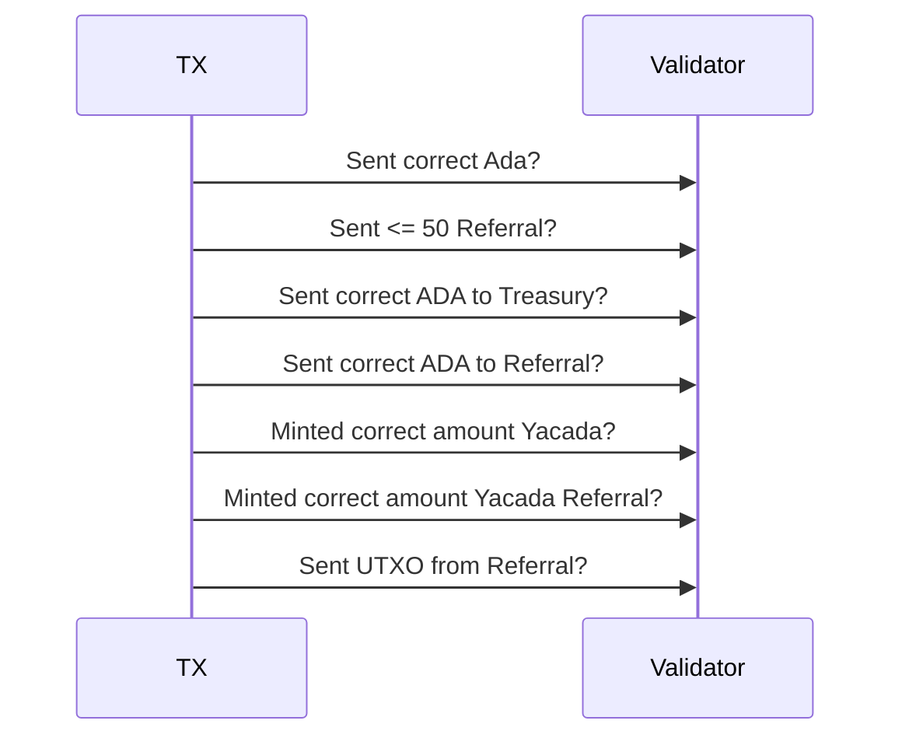
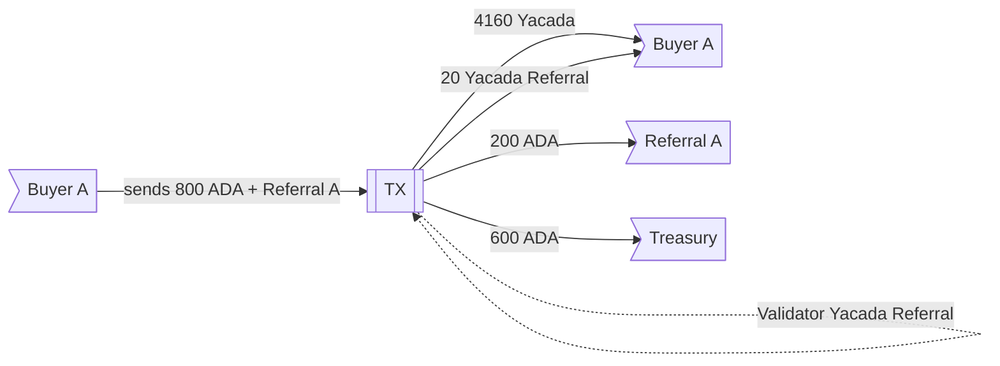

# Yacada minting 
## Token with community building 

The goal of this project is to provide a set of validators that can be customized. 
A token creator will be able to sell its tokens to the public, and give the possibility for buyers to earn by referral

 - When a buyer buys *Yacada* he will receive the amount he chose plus *Yacada Referral Tokens*. (See distribution table )
 - When any *Yacada Referral* holder public key address is used as a referral, he will receive up to 50% of the ADA invested by the referree
 - Each time a buyer referes someone that person will get an adicional 1% increase for the next referral
 - A token creator will be able to sell its tokens to the public, and give the possibility of the buyers
The token itself will have the utility the creator has in his use case (being a game, metaverse, etc.)

The current example set the sale with fixed bag.

 **Distribution Table**
|ADA                |Yacada |Yacada Referral|
|----------------|-------------------------------|-----------------------------|
|200|1000|5            |
|400|2040 |10           |
|600|3090|15|
|800|4160|20|
|1000|5250|25|

**example:** 
Buyer A gets the 1000 *ADA* Bag 
 - Buyer receives 5250 *Yacada* + 25 *Yacada Referral* 	
 - Treasury receives 1000 *ADA*

Buyer B buys Bag 800 and refers buyer A 	
 - Buyer B receives 4160 *Yacada* + 20 *Yacada Referral*   	
 - Buyer A receives 25% of Buyer B invested *ADA* = 200 *ADA* 	
 - treasury received 600 *ADA*

## Diagram of utxo and validator

Some of Validations made:

Example of transaction considering that referral A has 5 *YACADA_REFERRAL*

